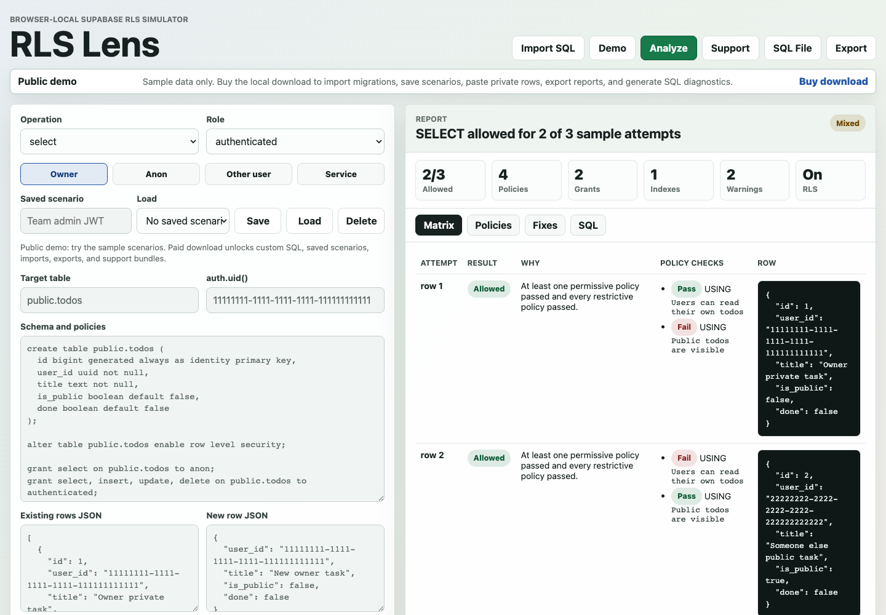
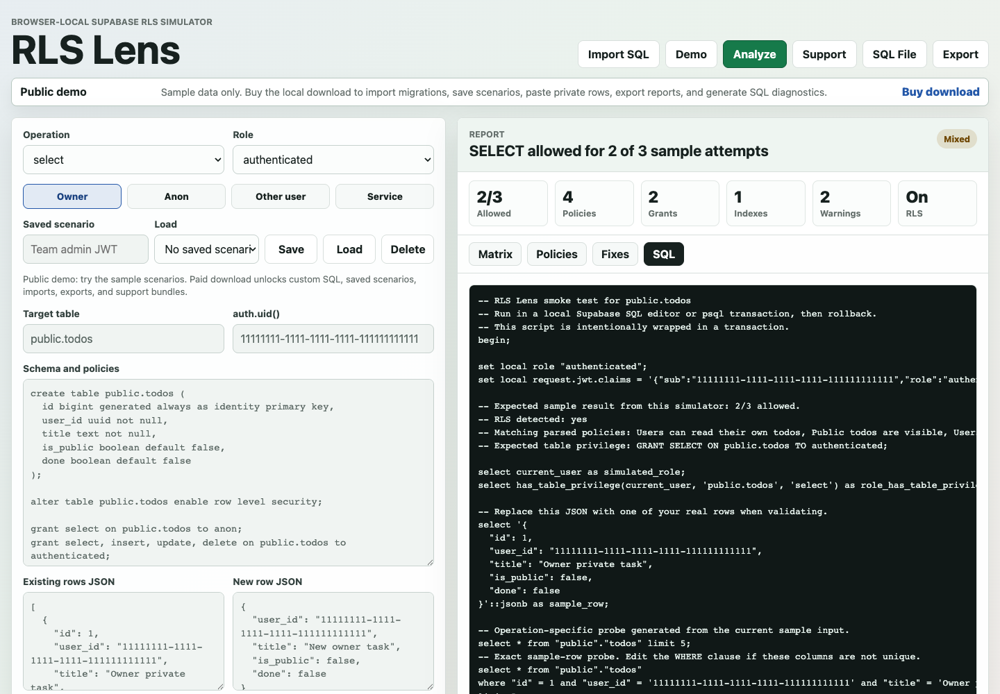

# RLS Lens - Supabase RLS Debugger

RLS Lens is a browser-local Supabase Row Level Security debugger. Paste policies, role/JWT context, and fake rows to see which rows are allowed, which policy blocked them, and what SQL diagnostic to run next.

## Links

- Live demo: https://cowboycodr.github.io/rls-lens-demo/
- Landing page: https://cowboycodr.github.io/rls-lens-demo/landing.html
- Manual purchase page: https://cowboycodr.github.io/rls-lens-demo/buy.html

## What It Checks

- `CREATE POLICY` for SELECT/INSERT/UPDATE/DELETE
- permissive vs restrictive policy behavior
- `USING` and `WITH CHECK`
- anon/authenticated/service_role request context
- table grants
- owner-column index hints for `auth.uid()` policies
- rollback-wrapped SQL diagnostics
- redacted support bundle export

## Screenshots

## Paid Package

The public Pages site intentionally excludes the paid zip. Buyers request a payment link from the manual purchase page. Current offers are the $19 local download and the $49 RLS Unblock Pass with one redacted policy review.
